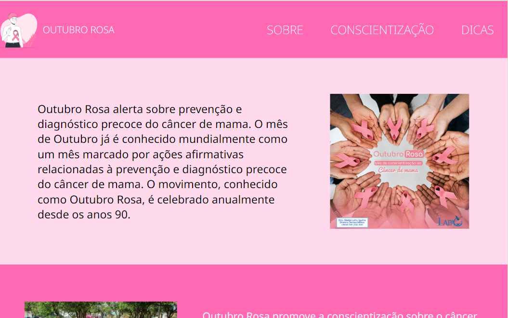
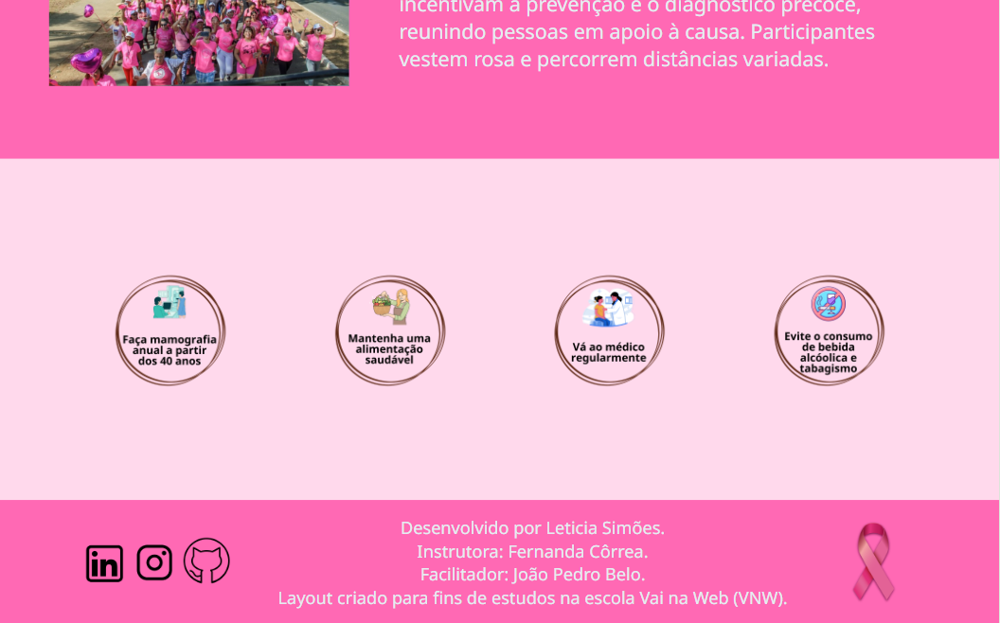

# Outubro Rosa 2024


## Descrição
Layout criado para fins de estudos na escola Vai na Web (VNW). Além disso O projeto **Outubro Rosa 2024** tem como objetivo promover a conscientização sobre a prevenção do câncer de mama. Durante o mês de outubro, buscamos engajar a comunidade em ações informativas e de apoio, ressaltando a importância do diagnóstico precoce e do autoexame.

## Tecnologias Utilizadas

- HTML
- SASS

## Funcionalidades

- Informações sobre o câncer de mama e sua prevenção.
- Design responsivo: garante acessibilidade em todos os dispositivos;

## Layout 



## Instalação

Para executar este projeto em sua máquina local, siga os passos abaixo:

1. Clone o repositório:
   ```bash
   git clone https://github.com/leticiasimoess/Outubro-Rosa2024.git

